# Architecture

## Traffic Flow & Security Model

### Traffic Flow

```mermaid
flowchart TB
    Client[("👤 Client Browser")]
    NPM["🔒 Nginx Proxy Manager<br/>(gsm-proxy)<br/>Ports: 80, 443, 81"]
    Frontend["📱 Frontend Container<br/>(gsm-frontend)<br/>nginx + React SPA<br/>Internal port: 80"]
    Backend["⚙️ Backend Container<br/>(gsm-backend)<br/>Node.js + Express<br/>Internal port: 5000"]
    MongoDB["🗄️ MongoDB<br/>(gsm-mongodb)<br/>Internal port: 27017"]
    Docker["🐳 Docker Socket<br/>/var/run/docker.sock"]
    GameServers["🎮 External Game<br/>Server Containers"]
    
    Client <-->|"HTTPS (443)<br/>your-domain.com<br/>Static files & API calls"| NPM
    NPM <-->|"HTTP (80)<br/>SSL Termination<br/>Proxies all requests"| Frontend
    Frontend -->|"Proxies /api/*<br/>to backend:5000"| Backend
    Backend -->|"Response"| Frontend
    Backend <-->|"Auth & Data"| MongoDB
    Backend -->|"Container Control"| Docker
    Docker -.->|"Manage"| GameServers
    
    style Client fill:#e1f5ff
    style NPM fill:#fff4e1
    style Frontend fill:#e8f5e9
    style Backend fill:#f3e5f5
    style MongoDB fill:#fce4ec
    style Docker fill:#e0f2f1
    style GameServers fill:#fff3e0
    
    subgraph "Internet"
        Client
    end
    
    subgraph "Docker Network (gsm-network)"
        NPM
        Frontend
        Backend
        MongoDB
    end
    
    subgraph "Host System"
        Docker
        GameServers
    end
```

### Security Model

- **🔒 SSL/TLS**: All external traffic encrypted via Nginx Proxy Manager
- **🔐 Internal Communication**: Containers communicate over isolated Docker network (HTTP only)
- **🚫 No Direct Access**: Backend and database not exposed to internet
- **🛡️ Single Entry Point**: Only ports 80, 443 (NPM) and 81 (NPM admin) accessible externally

### Key Design Decisions

1. **Frontend as Reverse Proxy**: Client never connects directly to backend - all API calls proxied through frontend nginx
2. **No Port Exposure**: Backend has no host port mapping, only accessible via Docker network
3. **SSL Termination at Edge**: NPM handles all SSL/TLS, internal services use HTTP
4. **External Container Management**: Game servers exist outside compose stack, managed via Docker socket
